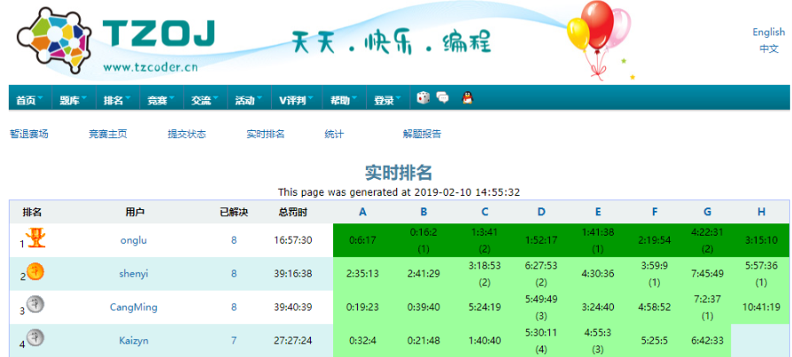
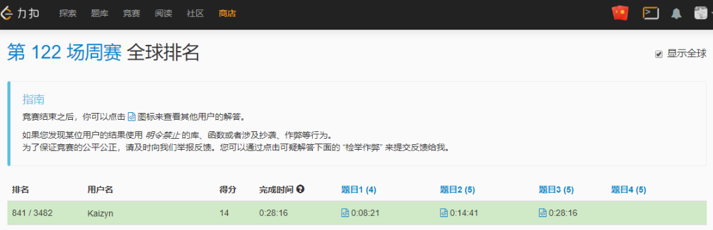
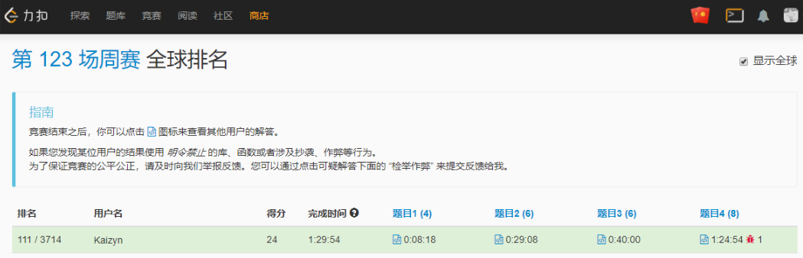
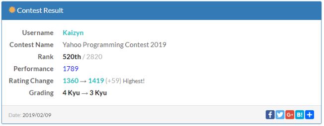
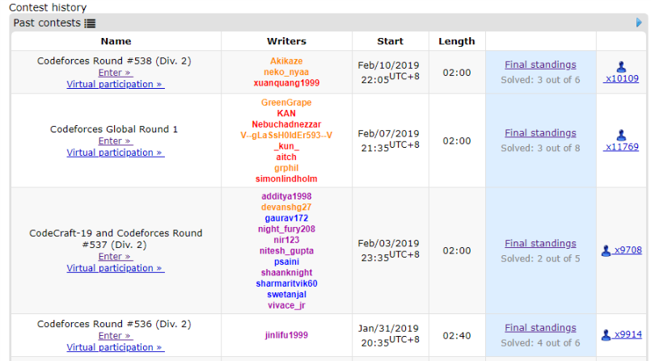

首先哀叹这个仅有十余天的寒假(2018.02.01-2019.02.11)

怎么说也是高三以来最长的(以及可能是最后的)假期啦

过的还是比较充实吧...(写作业是不可能的,这辈子都不可能的)

好歹坚持每天(平均下来)看点书

> 《数学之美》  ——吴军
> 《白鹿原》    ——陈忠实

这两本平均下来也有一天一章(自我安慰没有虚度时光)

机器学习的课程倒是拉下不少了...

还有每天坚持看一部电影(啦啦啦励志刷完豆瓣电影TOP250)

最后还是不忘肝OI

---

TZOJ

**北师大附中猪年快乐大奖赛**

题目较水(不存在的),一些数学题神仙...

最后一题写不来(据说前三有奖金,退役了就别去抢了哈)

很多搜得到原题,题解抄不来(///)

---

LeetCode

也就俩星期啊

明明觉得最后一题写出来了,感觉就是出BUG了(气)掉分

历史最高成就(排名还没更新)

---

Atcoder

本来有两场的,一场ABC,当晚还有CodeForces(虽然不冲突)但是懒得打(段位太高不排名)

发挥emmmm,很快就把会写得写完了,后面思考人生...不过上分了

---

CodeForces

比赛真多,打了四场

第一次好似被攻击了,延迟+不计排名,心态崩了

本来自我感觉良好,写了四题,唉

不过蓝名了呢,可喜可贺

