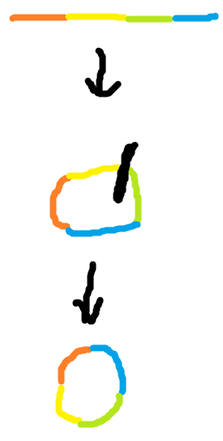
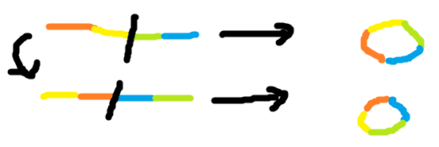

# [CodeForces 1025C Plasticine zebra](http://codeforces.com/contest/1025/problem/C)

## 题意

有一个由 $b,w$ 组成的串

可以进行 0 或任意次这样的操作:

从某个地方开始把串分成两部分

再把每一部分各自翻转

如 bwbbw -> bw|bbw -> wb|wbb -> wbwbb

使得最后串中 $wbwbwbwb$ 这样 $bw$ 交替的串的长度最大

## 样例

### 输入

    bwwwbwwbw

### 输出

    5

### 说明

bwwwbww|bw 
→
w|wbwwwbwb 
→
**wbwbw**wwbw

加粗部分长度为 5

## 思路

一开始觉得要DP吧

反正就是写不来

下面翻译自题解

假如我们把这个串看成一个环

那么一次操作类似下面



对整个环不造成影响

再把环展开的话

其实就相当于换了端点



那么问题就是从这个环上哪个点开始

符合要求的串最长

## 代码
```cpp
#include <cstdio>
#include <cstring>
#include <iostream>

using namespace std;

int ans = 1;
string str;

int main()
{
    cin >> str;
    str += str;
    for(int i = 1, cnt = 1; i < str.length(); ++i)
    {
        if(str[i] != str[i-1])
        {
            ans = max(ans, ++cnt);
            if(ans == str.length()/2) break;
        }
        else cnt = 1;
    }
    cout << ans << endl;
    return 0;
}
```