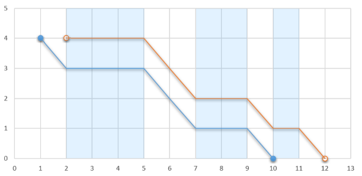

# A. [Heist](http://codeforces.com/contest/1041/problem/A)

大水题

## 题意

给n和数组ai(a1..an)

这个店的物品是编号从x开始的物品

x, x+1, x+2 ...

遭贼了,剩下的物品编号是ai...

求一个x,使得被偷的物品最多

输出被偷的物品数量

## 数据范围

1 <= n <= 1000
1 <= ai <= 10^9

## 思路

题意不好懂啊(还是俄式英文)

反正读懂了之后就一下子想到

设物品是x~y(y-x+1个)

ai有n个,所以被偷的的就是`y-x+1-n`个

即求y-x最小

因为ai肯定是x~y之间的

x <= ai <= y

求出ai的最小值和最大值就分别是x, y

```cpp
#include <cstdio>
#include <iostream>

using namespace std;

int n, a, maxa, mina;

int main()
{
	scanf("%d%d", &n, &a);
	maxa = mina = a;
	for(int i = 2; i <= n; ++i)
	{
		scanf("%d", &a);
		maxa = max(a, maxa);
		mina = min(a, mina);
	}
	printf("%d\n", maxa-mina+1-n);
	return 0;
}
```
---
# B. [Buying a TV Set](http://codeforces.com/contest/1041/problem/B)

略水

## 题意

输入a,b,x,y

买电视,需要这个电视长宽比是x:y

且长不超过a,宽不超过b

求满足的个数

## 数据范围

1 <= a,b,x,y <= 10^18

## 思路

很明显按照这个比例枚举

从最小的一直到长或者宽超出极限为止

从样例可以看出,x:y不是最简比

所以gcd约分一下,就是最小的了

设最小的是w, h

也就是`w = x/gcd, h = y/gcd`

枚举的数字是

    w, 2w, 3w
    h, 2h, 3h

所以用a/w就是w在不超过a的情况下最大个数

同理到宽

最后得到结果是 `min(a/w, b/w)`

```cpp
#include <cstdio>
#include <iostream>

using namespace std;

long long a, b, x, y;

long long gcd(long long a, long long b)
{
	return !b ? a : gcd(b, a%b);
}

int main()
{
	cin >> a >> b >> x >> y;
	long long tmp = gcd(x, y);
	x /= tmp; y /= tmp;
	cout << min(a/x, b/y) << endl;
	return 0;
}
```
---
# C. [Coffee Break](http://codeforces.com/contest/1041/problem/C)

有难度的一题

## 题意

某人一天有m分钟的工作时间

他想在n个ai时刻喝咖啡,没喝一次是1分钟

他喝每杯咖啡的间隔不得小于d

即要求aj - ai > d

输入n,m,d, ai...

求需要分成几天喝完

并输入任意一个方案(ai在第几天喝)

这道题不好理解啊,我题意都感觉见不清楚

分析一下样例

## 样例

### 输入

    4 5 3
    3 5 1 2

### 输出

    3
    3 1 1 2

### 解释

    day1:1, 5
    day2:2
    day3:3

那么可以理解了吧

就是把ai拆分成尽可能少的序列

使得每个序列中的元素两两之间差>d

## 数据范围

1 <= n <= 2*10^5
n <= m <= 10^9
1 <= d <= m

## 思路

就是贪心

假如这一天取了ai

那么下一个能取的是 >= ai+d+1

如果有 aj < ak

那么肯定先取aj,后面的选择余地才更大

这天选择的a才更多

然后...反正就是这样的贪心

总之先排序,然后

1. 暴力贪心O(n^2)
   
   就是一直取,选定第一个
   
   往后找到第一个符合的加进来

   知道这天安排不下

   再取下一天

   因为最多一天一杯咖啡

   所以最多有n天

   每天需要扫描n个

   所以就是O(n^2)

   妥妥TLE

2. 并查集优化的暴力O(n^2)

	我实在也没想到什么高超的方法

	就着手优化了

	容易发现上述暴力算法的累赘主要在扫描上

	会有很多被选走了得进行不必要的扫描

	于是用并查集

	如果这个数被选走了

	就把他(合并)指向它的下一个

	这样就能快一些了吧

	代码实现颇为复杂

	然而我忽略的事实是主要的时间

	还是花费在找合适的下一个值上

	所以复杂度仍然接近O(n^2)

	妥妥又TLE了

```cpp
#include <cstdio>
#include <iostream>
#include <algorithm>

using namespace std;

const int Maxn = 2e5+7;

int n, m, d, res, cnt;
int fa[Maxn], da[Maxn];

struct Coffee
{
	int a, id;
	bool operator < (const Coffee &b) const
	{
		return a < b.a;
	}
} c[Maxn];

int getf(int s) { return fa[s] == s ? s : fa[s] = getf(fa[s]); }

int main()
{
	scanf("%d%d%d", &n, &m, &d);
	for(int i = 1; i <= n; ++i)
		scanf("%d", &c[i].a), fa[i] = i, c[i].id = i;
	sort(c+1, c+n+1);
	while(cnt < n)
	{
		int cur = getf(1), last;
		da[c[cur].id] = ++res;
		if(++cnt == n) break;
		last = cur;
		cur = fa[cur] = getf(cur+1);
		while(cur)
		{
			while(cur && c[last].a+d >= c[cur].a)
				cur = getf(cur+1);
			if(!cur) break;
			da[c[cur].id] = res;
			if(++cnt == n) break;
			last = cur;
			cur = fa[cur] = getf(cur+1);
		}
	}
	printf("%d\n", res);
	for(int i = 1; i < n; ++i)
		printf("%d ", da[i]);
	printf("%d\n", da[n]);
	return 0;
}
```

3. 优先队列O(n log n)
   
   最后聪明的我还是想出了方法

	稍微转换一下思路

	对于每个aj,我们给它接到一个ai

	ai + d + 1 <= aj 

	我们是从小到大安排aj的

	那么找这个ai

	根据贪心的原则

	就得找最小的

	怎么找最小的

	优先队列

	如果找不到,就另起一天

```cpp
#include <queue>
#include <cstdio>
#include <iostream>
#include <algorithm>

using namespace std;

const int Maxn = 2e5+7;

int n, m, d, res;
int da[Maxn];

priority_queue<pair<int,int>,vector<pair<int,int> >, greater<pair<int,int> > > q;

struct Coffee
{
	int a, id;
	bool operator < (const Coffee &b) const
	{
		return a < b.a;
	}
} c[Maxn];

int main()
{
	scanf("%d%d%d", &n, &m, &d);
	for(int i = 1; i <= n; ++i)
		scanf("%d", &c[i].a), c[i].id = i;
	sort(c+1, c+n+1);
	da[c[1].id] = ++res;
	q.push(make_pair(c[1].a, 1));
	pair<int, int> cur;
	for(int i = 2; i <= n; ++i)
	{
		cur = q.top();
		if(cur.first+d+1 > c[i].a)
		{
			da[c[i].id] = ++res;
			q.push(make_pair(c[i].a, res));
		}
		else
		{
			q.pop();
			da[c[i].id] = cur.second;
			q.push(make_pair(c[i].a, cur.second));
		}
	}
	printf("%d\n", res);
	for(int i = 1; i < n; ++i)
		printf("%d ", da[i]);
	printf("%d\n", da[n]);
	return 0;
}
```

---
# D. [Glider](http://codeforces.com/contest/1041/problem/D)

## 题意

人从高度h的飞机上跳下

每秒水平位移1(向右)

竖直位移1(向下)

然后在横坐标x1-x2的位置有上升气流

就是能让你在x1-x2竖直位移为0

(当你已经落到地上则气流无效了)

求从哪个x起点跳下去能获得最大水平位移

输出水平位移

## 样例

输入

	3 4
	2 5
	7 9
	10 11

输出

	10

解释



如果从x=1跳,如图蓝线所示

水平位移是1~10也就是9

如果从x=2开始跳,如图橘线所示

水平位移2~12也就是10


## 思路

其实我是没在比赛结束前敲出来

大致就像是单调队列

首先清楚的一点是起点应该从某气流的左端

还能往前飞就往前飞,同时往下掉

如果不能飞了,把最前面那段气流的路程减去

把第一次下降的高度加回去

还是比较清晰的

就是如何实现我废了好久,于是没来得及

本来想把每段气流长度和气流的间隔预处理一下

后来发现难以实现,所以没来得及

再后来就朴素的每个气流的端点来

设端点a(i)

如果i是奇数,那么a(i)~a(i+1)是气流

如果i是偶数,那么a(i)~a(i+1)~~假~~自由落体

以下是原来的代码

```cpp
#include <cstdio>
#include <iostream>

using namespace std;

const int Maxn = 2e5+7;

int n, H, ans;
int a[Maxn<<1];

int main()
{
	scanf("%d%d", &n, &H);
	for(int i = 1; i <= n*2; ++i)
		scanf("%d", a+i);
	int head = 1, tail = 1, curx = 0, curh = H, tmp;
	ans = H+a[2]-a[1];
	while(tail <= n*2)
	{
		while(tail <= n*2)
		{
			if(tail&1)
			{
				if(curh <= 0) break;
				curx += a[tail+1]-a[tail];
				tail++;
			}
			else
			{
				tmp = a[tail+1]-a[tail];
				if(curh-tmp >= 0)
				{
					curx += tmp;
					curh -= tmp;
					tail++;
				}
				else break;
			}
			ans = max(ans, curx+curh);
		}
		// can't move now
		// head is odd
		if(head >= tail) break;
		curx -= a[head+1]-a[head];
		head++;
		// head is even
		if(head >= tail) break;
		curx -= a[head+1]-a[head];
		curh += a[head+1]-a[head];
		head++;
	}
	printf("%d\n", ans);
	return 0;
}
```

评测结束后交了一发WA

因为样例是对了不少,一定有什么没考虑到

错的那组数据我求出来的值比答案小了很多

于是emmm

我稍加思考,冷静分析

发现一个坑就是:可能存在两段气流的间隔大于h

导致不管怎么回退之前掉落得高度也无法迈过这道坎

于是没有找完所有情况

如这组情况

输入

	4 4
	2 5
	7 9
	10 11
	20 100

我的答案

	10

正确答案

	84


那么,也只需要稍加修改,就AC了

```cpp
#include <cstdio>
#include <iostream>

using namespace std;

const int Maxn = 2e5+7;

int n, H, ans;
int a[Maxn<<1];

int main()
{
	scanf("%d%d", &n, &H);
	for(int i = 1; i <= n*2; ++i)
		scanf("%d", a+i);
	int head = 1, tail = 1, curx = 0, curh = H, tmp;
	ans = H+a[2]-a[1];
	while(tail <= n*2)
	{
		while(head <= tail)
		{
			while(tail <= n*2)
			{
				if(tail&1)
				{
					if(curh <= 0) break;
					curx += a[tail+1]-a[tail];
					tail++;
				}
				else
				{
					tmp = a[tail+1]-a[tail];
					if(curh-tmp >= 0)
					{
						curx += tmp;
						curh -= tmp;
						tail++;
					}
					else break;
				}
				ans = max(ans, curx+curh);
			}
			// can't move now
			// head is odd
			if(head >= tail) break;
			curx -= a[head+1]-a[head];
			head++;
			// head is even
			if(head >= tail) break;
			curx -= a[head+1]-a[head];
			curh += a[head+1]-a[head];
			head++;
		}
		// can't cross tail to tail+1
		tail++;
		head++;
		curh = H;
		curx = 0;
	}
	printf("%d\n", ans);
	return 0;
}
```
---

最终结果是做出3/6

排名1796

上分1459+13=1472

因为这比赛在周日晚18:35~20:35

我是溜过来打的,比赛结束继续敲完了D题

再写写博客,又过了一小时

回去是几乎夜自修结束

从机房出来遇到办公室老是被数落一番

回到寝室班主任找上门

出发点应该是夜自修不在

于是又被数落一番

顺带又数落全寝

(三加一的一模成绩下午刚出来)

怎么说呢

**并不后悔**