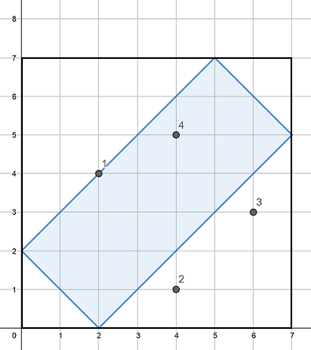
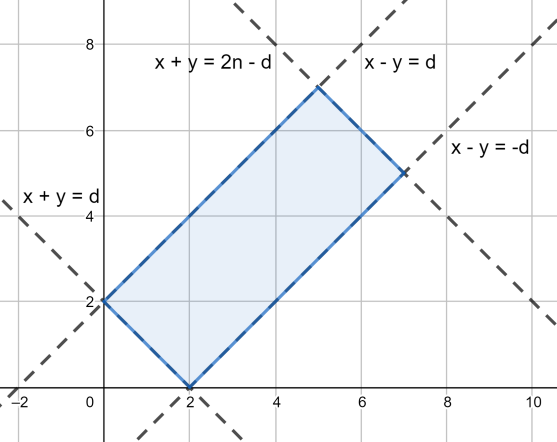

# [Codeforces Round 512 Vasya and Cornfield](http://codeforces.com/contest/1030/problem/B)

## 题意

给 $n,d$

以 $(0,d),(d,0),(n,n-d),(n-d,n)$ 为定点的矩形

$m$ 次询问, 每次输入 $(x_i,y_i)$

求这个点是否在矩形内

## 样例

### 输入 

    7 2
    4
    2 4
    4 1
    6 3
    4 5

### 输出

    YES
    NO
    NO
    YES

### 说明



## 思路

### 暴力求解

完全数学化

两点确定一条直线

所以可以求出这四条边的方程

记作`ax+by-k=0`

利用点到直线的距离

`dis = (ax+by-k)/sqrt(a^2+b^2)`

当点在矩形内的时候

点到两条宽的距离和就是长

到两条长的距离和就是宽

把握一下精度应该就可以了

### 代码
```cpp
#include <bits/stdc++.h>

using namespace std;

const double eps = 1e-5;

int d, n, m;

struct Line
{
	int a, b, k;
	// ax+by+k = 0
	
	inline void init(int x1, int y1, int x2, int y2)
	{
		int dx = x1-x2, dy = y1-y2;
		// y - y1 = (dx/dy)(x-x1)
		// dy*y-dy*y1 = dx*x-dx*x1
		// dx*x-dy*y-dx*x1+dy*y1 = 0
		a = dx; b = -dy;
		k = dy*y1-dx*x1;
		int gcd = __gcd(__gcd(a, b), k);
		a /= gcd; b /= gcd; k /= gcd;
	}

	inline double dis(int x, int y)
	{
		return abs((a*x+b*y+k))/sqrt(a*a+b*b);
	}
} l[4];

inline double point_dis(int x1, int y1, int x2, int y2)
{
	return sqrt((x1-x2)*(x1-x2)+(y1-y2)*(y1-y2));
}

int main()
{
	scanf("%d%d%d", &n, &d, &m);
	l[0].init(0, d, d, 0);
	l[1].init(n, n-d, n-d, n);
	l[2].init(0, d, n-d, n);
	l[3].init(d, 0, n, n-d);
	double len01 = point_dis(0, d, n-d, n),
		   len23 = point_dis(0, d, d, 0);
	while(m--)
	{
		int x, y;
		scanf("%d%d", &x, &y);
		if(abs(l[0].dis(x, y)+l[1].dis(x, y)-len01) < eps
		&& abs(l[2].dis(x, y)+l[3].dis(x, y)-len23) < eps)
			puts("YES");
		else puts("NO");
	}
	return 0;
}
```

### 观察优化

通过观察~~看题解~~发现

其实这四条边的斜率是一定的!

于是可以这么表示



紧接着用**线性规划**

$$\begin{cases}
x+y \geq d \\
x+y \leq 2n-d \\
x-y \geq -d \\
x-y \leq d 
\end{cases}
$$

### 代码
```cpp
#include <bits/stdc++.h>

using namespace std;

int n, d, m, x, y;

int main()
{
	scanf("%d%d%d", &n, &d, &m);
	while(m--)
	{
		scanf("%d%d", &x, &y);
		if(x+y >= d && x+y <= 2*n-d && x-y >= -d && x-y <= d) puts("YES");
		else puts("NO");
	}
	return 0;
}
```
