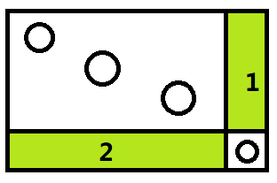
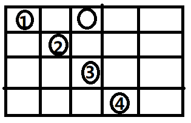

# [Luogu P1736 创意吃鱼法](https://www.luogu.org/problemnew/show/P1736)

## 题意

给出 n 列 m 行的 01 矩阵

求某一个正方形子矩阵 除了某条对角线是 1 其余都是 0

这个 1 的长度最大是多少

## 数据范围

$n,m \leq 2500$

## 样例

### 输入

    4 6
    0 1 0 1 0 0
    0 0 1 0 1 0
    1 1 0 0 0 1
    0 1 1 0 1 0

### 输出

    3

### 说明

右上角 (1,4) 到 (3,6)

    1 0 0
    0 1 0
    0 0 1

## 思路

既然是DP题嘛(提前知道)

想想状态转移方程

对角线无非两种

1. 

    1 0 0
    0 1 0   
    0 0 1

2. 

    0 0 1
    0 1 0
    1 0 0


设 $f[i][j]$ 是以 (i, j) 为右下角的矩阵的最大长度

那么 第一种 `if(条件成立) f[i][j] = f[i-1][j-1]+1`

第二种 `if(条件成立) f[i][j] = f[i+1][j-1]+1`

我们看条件,是这个矩阵其他地方都是 0

当状态转移时,我们只需要考虑矩阵新加的那部分

举第一种的栗子

如图所示绿色部分即为新增加的



怎么判断绿色部分全是 0 呢

只要绿色**区间**和为 0 即可

这里有两种方案

1. 用一维前缀和

    绿色区间 1 用记录每一列的前缀和 $sv[][]$

    绿色区间 2 用记录每一行的前缀和 $st[][]$

    对于第一种的情况实现代码大致如下

    ```cpp
    int tmp = f[i-1][j-1][0];
    if(st[i][j-1]-st[i][j-tmp-1] == 0
    && sv[i-1][j]-sv[i-tmp-1][j] == 0)
        f[i][j][0] = tmp+1;
    ```
2. 用二维前缀和

    问题等价于当前这个矩阵

    也就是上图整个矩阵内的 1 的个数恰好等于对角线长度

    用 $s[i][j]$ 表示以 (0,0) 到 (i,j) 的矩阵区间和

    那么以 `(x,y)` 为右下角,对角线长为 `l` 的矩阵的和就是
    
        s[x][y]-s[x-l][y]-s[x][y-l]+s[x-l][y-l]

    成立条件就是

        s[x][y]-s[x-l][y]-s[x][y-l]+s[x-l][y-l] == l

复杂度 $O(n^2)$

想到这里,我不禁狂笑一声,交了个 WA

---

### $O(n^2 \log n)$算法

当你遇到这种情况



如果按上述情况来

处理到 3 的时候

无法满足条件,此时的值变为 1

继而 4 的值是 2

但事实呢

发现 3 的值即使无法达到 3, 但还是可以达到 2

于是怎么办呢...

二分找到一个长度使得满足条件啊

这样复杂度就是 $O(n^2 \log n)$

最坏情况 $\log n \approx 10$

但是除非特殊构造的图(只有对角线)

才可能到达这样的复杂度

而且当 当前格子上没有东西时是不进行计算的

所以可以显然得出这个多出来的 $\log n$ 可以忽略不计

再者教科书上一秒 $10^6$ 已经过时了

所以~~盲目分析~~得到复杂度为 $O(kn^2),(k << 10)$

再来考虑是基于上述方案一还是方案二

如果是方案一


二分长度后

分别计算两个绿色部分是否满足

那如果是方案二呢

二分长度后

计算这样大小的正方形矩阵内是否只有那么多食物

### 代码

```cpp
#include <cstdio>
#include <iostream>

using namespace std;

const int Maxn = 2507;

int n, m, ans;
int a[Maxn][Maxn], s[Maxn][Maxn];
int f[Maxn][Maxn][2];

inline int calc(int x, int y, int l)
{
    return s[x][y]-s[x-l][y]-s[x][y-l]+s[x-l][y-l];
}

int main()
{
    scanf("%d%d", &n, &m);
    for(int i = 1; i <= n; ++i)
        for(int j = 1; j <= m; ++j)
        {
            scanf("%d", &a[i][j]);
            s[i][j] = s[i-1][j]+s[i][j-1]-s[i-1][j-1]+a[i][j];
        }

    for(int j = 1, l, r, mid; j <= m; ++j)
    {
        for(int i = 1; i <= n; ++i)
        {
            if(a[i][j])
            {
                l = 1; r = f[i-1][j-1][0]+1;
                while(l < r)
                {
                    mid = (l+r+1)>>1;
                    if(calc(i, j, mid) == mid) l = mid;
                    else r = mid-1;
                }
                f[i][j][0] = l;

                l = 1; r = f[i+1][j-1][1]+1;
                while(l < r)
                {
                    mid = (l+r+1)>>1;
                    if(calc(i+mid-1, j, mid) == mid) l = mid;
                    else r = mid-1;
                }
                f[i][j][1] = l;

                ans = max(ans, max(f[i][j][0], f[i][j][1]));
            }
        }
    }
    printf("%d\n", ans);
    return 0;
}
```

### $O(n^2)$算法

我们再仔细一想~~看下题解~~

发现确实存在实打实的 $O(n^2)$ 算法

思路类比 [P1387 最大正方形](https://www.luogu.org/problemnew/show/P1387)

再次拿出这张图


在上面我们采用的是二分答案再判断是否符合

其实我们可以预处理出 比如区间 1 最多可以满足多少

结果就是 `min(区间1, 区间2, 对角线)`

所谓的区间 1 最多能满足多少

其实就是 从右下角上一格(区间 1 最下端) 开始有几个连续的 0

这个很好预处理出来

由于空间限制,故没法同时进行两种对角线情况

代码如下

事实上这种算法运行起来比上面的 $O(n^2 \log n)$ 慢

原因大概是常数比较大吧

侧面也可以说明 $O(n^2 \log n)$ 其实远达不到上界

### 代码

```cpp
#include <cstdio>
#include <iostream>

using namespace std;

const int Maxn = 2507;

int n, m, ans;
int a[Maxn][Maxn], st[Maxn][Maxn], sv[Maxn][Maxn], f[Maxn][Maxn];

inline void read(int &);
inline int min3(int a, int b, int c) { return min(min(a, b), c); }

int main()
{
	read(n); read(m);
	for(int i = 1; i <= n; ++i)
		for(int j = 1; j <= m; ++j)
		{
			read(a[i][j]);
			if(a[i][j]) st[i][j] = sv[i][j] = 0;
			else st[i][j] = st[i][j-1]+1, sv[i][j] = sv[i-1][j]+1;
		}

	for(int j = 1; j <= m; ++j)
		for(int i = 1; i <= n; ++i)
			if(a[i][j])
				ans = max(ans, f[i][j] = min3(f[i-1][j-1], st[i][j-1], sv[i-1][j])+1);

	for(int j = 1; j <= m; ++j)
		for(int i = n; i; --i)
			if(a[i][j]) sv[i][j] = 0;
			else sv[i][j] = sv[i+1][j]+1;

	for(int j = 1; j <= m; ++j)
		for(int i = 1; i <= n; ++i)
			if(a[i][j])
				ans = max(ans, f[i][j] = min3(f[i+1][j-1], st[i][j-1], sv[i+1][j])+1);

	printf("%d\n", ans);
	return 0;
}

inline void read(int &x) { char c; while((c=getchar()) < '0' || c > '9'); x = c-'0'; while((c=getchar()) >= '0' && c <= '9') x = (x<<3)+(x<<1) + c-'0'; }
```